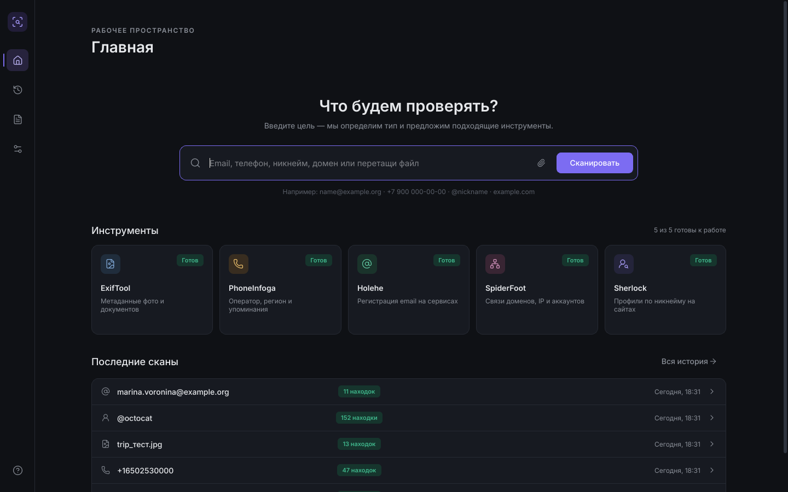

# OSINT Hub

[](LICENSE)  

Десктопное приложение для Windows 10/11 x64. Объединяет пять open-source OSINT-инструментов в одном интерфейсе:

| Инструмент | Что делает | Как подключён |
|---|---|---|
| [ExifTool](https://exiftool.org) 13.59 | метаданные фото и документов: GPS, даты, устройство, автор | `tools\exiftool\exiftool.exe`, subprocess |
| [PhoneInfoga](https://github.com/sundowndev/phoneinfoga) 2.11.0 | страна, оператор, ссылки для поиска по номеру | `tools\phoneinfoga\phoneinfoga.exe`, subprocess |
| [Holehe](https://github.com/megadose/holehe) 1.61 | на каких сервисах зарегистрирован email | библиотека внутри процесса |
| [SpiderFoot](https://github.com/smicallef/spiderfoot) 4.0 | связи домена, IP, email, телефона, никнейма | свой встроенный Python 3.11, CLI |
| [Sherlock](https://github.com/sherlock-project/sherlock) 0.16.2 | поиск никнейма на ~460 сайтах | библиотека внутри процесса |



> **Используйте приложение только для проверки собственного цифрового следа и исследований, на которые у вас есть разрешение.**
> Соблюдайте законодательство о персональных данных (152-ФЗ, GDPR) и правила сервисов. При первом запуске приложение просит подтвердить согласие с этим. Подробнее — в разделе [Правовая информация](#правовая-информация-законодательство-рф).

## Возможности

- **Одно поле ввода.** Приложение само определяет тип цели (email, телефон, никнейм, домен, IP, файл) и предлагает подходящие инструменты переключателями. Если строку можно понять двояко (`john.doe` — домен или никнейм?), тип можно выбрать вручную.
- **Файлы.** Файл можно перетащить на окно или выбрать скрепкой в поле ввода, после чего сразу запускается ExifTool.
- **Сканирование в фоне.** Сканы идут в фоновом потоке, интерфейс не зависает. Для каждого инструмента видны прогресс и живой лог, любой инструмент можно остановить или запустить повторно.
- **Ошибки изолированы.** Если инструмент не установлен, упал или превысил таймаут, об этом появляется понятное сообщение, а остальные инструменты продолжают работать. Находки, собранные до таймаута, сохраняются.
- **Результаты.**
  - Сводка, вкладки по инструментам, таблица с поиском и фильтрами по типу и достоверности, вкладка сырого вывода.
  - Карта Leaflet и OpenStreetMap для GPS из ExifTool.
  - Карточки профилей для Sherlock.
- **Связанные находки.** Найденные email, никнеймы, телефоны и домены можно одной кнопкой проверить другими инструментами.
- **История.** Поиск, фильтры, повторный запуск, удаление.
- **Экспорт отчёта** в JSON или HTML (тёмная тема, подходит для печати) с выбором разделов.
- **Настройки.**
  - Регион по умолчанию, число параллельных инструментов, лимит размера файла.
  - Включение и параметры каждого инструмента: таймауты, модули.
  - API-ключи.

## Установка

Скачайте `OSINTHub-Setup-1.0.0.exe` со страницы [Releases](https://github.com/Nexor-1/osint-hub/releases) и запустите. Права администратора не нужны: по умолчанию приложение ставится для текущего пользователя, а в мастере можно выбрать установку для всех.

- Установщик создаёт ярлыки на рабочем столе и в меню «Пуск», а также деинсталлятор.
- Python на компьютере не нужен: всё нужное, включая инструменты, лежит внутри.

Где приложение хранит данные:

| Что | Где |
|---|---|
| История, настройки, журналы | `%APPDATA%\OSINTHub\` (`osinthub.db`, `settings.json`, `logs\`) |
| API-ключи | Диспетчер учётных данных Windows (сервис `OSINTHub`) |
| Отчёты (по умолчанию) | `Документы\OSINT Hub\Отчёты` |

При удалении деинсталлятор спрашивает, удалять ли историю и настройки.

Проверить установку без интерфейса:

```bash
"%LOCALAPPDATA%\Programs\OSINT Hub\OSINTHub.exe" --selftest "%TEMP%\osinthub_selftest.json"
```

Отчёт `osinthub_selftest.json` показывает, запускается ли каждый инструмент. ExifTool проверяется на сгенерированном JPEG с GPS.

## Сборка из исходников

Требования:

- Windows 10/11 x64;
- Python 3.11+ ([python.org](https://www.python.org/downloads/), галочка «Add to PATH» или Python Launcher `py`);
- [Inno Setup 6](https://jrsoftware.org/isinfo.php), нужен только для установщика (`winget install JRSoftware.InnoSetup`);
- интернет при первой сборке и около 2 ГБ свободного места.

Собрать всё одной командой:

```bash
build.bat
```

Что делает скрипт:

1. Находит Python 3.11+ и создаёт `.venv` с зависимостями из `requirements-dev.txt`.
2. Запускает тесты (`pytest`).
3. Скачивает встроенные инструменты в `tools\` (`scripts\fetch_tools.py`) и сверяет SHA-256 с суммами, опубликованными авторами, или с зафиксированными в скрипте.
4. Собирает тексты лицензий всех Python-пакетов из сборки в `licenses\python\` (`scripts\collect_licenses.py`), затем собирает приложение через PyInstaller (`build\osinthub.spec`, режим one-folder, без консольного окна) в `dist\OSINTHub\`.
5. Копирует `tools\` рядом с `OSINTHub.exe`.
6. Запускает `OSINTHub.exe --selftest`. Если какой-то инструмент не стартует, сборка останавливается.
7. Собирает установщик Inno Setup (`build\installer.iss`) в `dist\installer\OSINTHub-Setup-1.0.0.exe`.

Ключи:

| Ключ | Действие |
|---|---|
| `--skip-tests` | без pytest |
| `--no-installer` | остановиться на `dist\OSINTHub` |
| `--update-tools` | перекачать встроенные инструменты |

### Запуск из исходников без сборки

```bash
py -3.12 -m venv .venv
```

```bash
.venv\Scripts\python -m pip install -r requirements-dev.txt
```

```bash
.venv\Scripts\python scripts\fetch_tools.py
```

```bash
.venv\Scripts\python osinthub.py
```

## Конфигурация и API-ключи

Ключи вводятся в разделе **Настройки → API-ключи** и сохраняются в Диспетчере учётных данных Windows. В код и `settings.json` они не попадают, в отчёты и логи тоже.

Также ключи можно задать файлом `.env` рядом с `OSINTHub.exe` или в `%APPDATA%\OSINTHub\.env`; значения из `.env` важнее сохранённых. Образец лежит в [.env.example](.env.example).

| Переменная | Для чего |
|---|---|
| `NUMVERIFY_API_KEY` | PhoneInfoga: оператор и регион через Numverify |
| `GOOGLE_API_KEY`, `GOOGLECSE_CX` | PhoneInfoga: поиск упоминаний через Google Custom Search |
| `SF_SHODAN_API_KEY`, `SF_HIBP_API_KEY`, `SF_HUNTER_API_KEY`, `SF_SECURITYTRAILS_API_KEY`, `SF_VIRUSTOTAL_API_KEY`, `SF_IPINFO_API_KEY`, `SF_EMAILREP_API_KEY` | модули SpiderFoot; модули, для которых задан ключ, включаются в быстрый профиль автоматически |
| `OSINTHUB_DATA_DIR` | другая папка данных вместо `%APPDATA%\OSINTHub` |
| `OSINTHUB_TOOLS_DIR` | другая папка инструментов вместо `tools\` рядом с exe |

Без ключей работают все пять инструментов, просто с меньшим числом источников.

## Как обновлять встроенные инструменты

**Бинарные инструменты.** Версии и контрольные суммы закреплены в начале [scripts/fetch_tools.py](scripts/fetch_tools.py):

| Константа | Что поменять |
|---|---|
| `EXIFTOOL_VERSION` | номер новой версии с exiftool.org; SHA-256 скрипт берёт из `checksums.txt` на сайте |
| `PHONEINFOGA_VERSION` | тег релиза на GitHub; сумма берётся из `phoneinfoga_checksums.txt` релиза |
| `SPIDERFOOT_COMMIT`, `SPIDERFOOT_SHA256` | нужный коммит SpiderFoot; если `SPIDERFOOT_SHA256` оставить пустым, скрипт напечатает фактический SHA-256, его нужно проверить и вписать |
| `PYTHON_EMBED_VERSION`, `PYTHON_EMBED_SHA256` | версия встроенного Python для SpiderFoot; держите 3.11, так как его зависимости закреплены под неё |

После изменения констант:

```bash
.venv\Scripts\python scripts\fetch_tools.py --force exiftool
```

Вместо `exiftool` можно указать нужный инструмент или ничего, тогда обновятся все. Затем проверьте и пересоберите:

```bash
.venv\Scripts\python scripts\smoke_test.py
```

```bash
build.bat --update-tools
```

`smoke_test.py` прогоняет каждый инструмент через движок на публичных тестовых данных.

**Python-библиотеки.** Holehe и Sherlock обновляются через версии в [requirements.txt](requirements.txt), после чего нужно выполнить `pip install -r requirements-dev.txt` и `build.bat`.

**База сайтов Sherlock** обновляется без пересборки: **Настройки → Инструменты → Sherlock → Параметры → Обновить базу сайтов**. Свежая база сохраняется в `%APPDATA%\OSINTHub\sherlock\data.json` и используется вместо встроенной.

Если формат вывода инструмента изменился, тесты парсеров (`tests\test_parsers.py`) покажут это на сохранённых образцах из `tests\fixtures\`. После обновления образцы можно снять заново:

```bash
.venv\Scripts\python scripts\smoke_test.py --save-fixtures
```

## Добавить новый инструмент

Нужен один файл `app\adapters\<имя>.py`, остальной код менять не надо. Приложение подхватывает его автоматически: на главной, в настройках, в экспорте и в связанных находках.

```python
from app.adapters.base import OptionSpec, RunContext, ToolAdapter, ToolError
from app.core import proc
from app.core.schema import Confidence, Finding, FindingType, TargetType


class MyToolAdapter(ToolAdapter):
    name = "mytool"
    title = "MyTool"
    description = "Что делает инструмент"
    input_types = frozenset({TargetType.DOMAIN})
    default_timeout = 120
    icon, accent, order = "globe", "blue", 60
    options = (OptionSpec("depth", "Глубина", "int", 2, minimum=1, maximum=5),)

    async def run(self, target: str, ctx: RunContext):
        ctx.progress(None, "Запуск")
        res = await proc.run([self.tools_dir / "mytool" / "mytool.exe", "--json", target],
                             timeout=ctx.timeout, on_stderr=lambda l: ctx.log(l, "warn"))
        if res.returncode != 0:
            raise ToolError(res.stderr.strip()[-300:])
        return {"stdout": res.stdout}

    def parse_output(self, raw) -> list[Finding]:
        return [Finding(FindingType.DOMAIN.value, line, "MyTool", Confidence.MEDIUM.value)
                for line in raw["stdout"].splitlines() if line]
```

Остальное делает `ToolAdapter.execute()`:

- валидирует ввод: строгие белые списки символов, значения не могут начинаться с `-`;
- проверяет, что инструмент установлен;
- следит за таймаутом и убивает всё дерево процессов;
- обрабатывает отмену и падения;
- сохраняет частичные результаты.

Subprocess запускается только через `app.core.proc.run`: список аргументов, без `shell=True`, с флагом `CREATE_NO_WINDOW`. Для `parse_output` добавьте тест на образец вывода в `tests\fixtures\`.

## Архитектура

```
osinthub.py              точка входа (и PyInstaller entry)
app/
  config.py              пути, settings.json, секреты (keyring + .env)
  selftest.py            OSINTHub.exe --selftest
  core/
    schema.py            общая схема: {tool, target, status, started_at, finished_at, findings[], raw}
    validation.py        валидация и нормализация ввода
    detect.py            автоопределение типа цели
    proc.py              безопасный subprocess, CREATE_NO_WINDOW, kill дерева процессов
    runner.py            ScanEngine: asyncio-цикл в отдельном потоке, очередь, отмена, события
    storage.py           SQLite: scans, tool_runs, findings, reports
    related.py           «связанные находки»
    export.py, templates/report.html.j2
  adapters/              base.py + по файлу на инструмент (автообнаружение)
  ui/                    PySide6: theme.py (токены из макетов), widgets.py, pages/, dialogs.py, map/
scripts/                 fetch_tools.py, collect_licenses.py, smoke_test.py, ui_snapshots.py, make_icon.py
licenses/                тексты лицензий (LGPL-3.0, Lucide, Python-пакеты — генерируются)
build/                   osinthub.spec, installer.iss, version_info.txt, disclaimer.txt
design/                  макеты и скриншоты экранов
tests/                   тесты и образцы вывода инструментов
```

Как устроено:

- **Движок.** Движок сканов работает в собственном потоке с asyncio-циклом. Интерфейс получает события (статус, прогресс, лог, завершение) через Qt-сигналы, поэтому окно не блокируется.
- **SpiderFoot** живёт в отдельном встроенном CPython 3.11. Его закреплённые зависимости (`lxml<5`, `cryptography<4`, `pyOpenSSL<22`) несовместимы с остальным приложением в одном процессе.
- **PhoneInfoga** запускается в режиме `scan`, а его текстовый вывод разбирается парсером. Режим `serve` с JSON API не используется: он слушает на всех сетевых интерфейсах, из-за чего Windows Firewall выводит запрос, а API становится доступен из локальной сети.

## Тесты и проверки

```bash
.venv\Scripts\python -m pytest
```

Юнит-тесты: парсеры всех инструментов, валидация, движок, экспорт.

```bash
.venv\Scripts\python scripts\smoke_test.py
```

Реальный прогон пяти инструментов на публичных данных: `example.com`, `octocat`, `test@example.com`, публичный номер компании, тестовое фото.

```bash
.venv\Scripts\python scripts\ui_snapshots.py build\snapshots
```

PNG-снимки всех экранов на демонстрационных данных.

## Известные ограничения

- **Holehe** не обновлялся с 2024 года. Часть модулей отвечает «лимит запросов» или ломается при изменении сайтов; такие модули показываются как «не удалось проверить». Модули, которые проверяют через восстановление пароля (Adobe, Mail.ru, OK, Samsung), по умолчанию выключены, потому что владелец аккаунта может заметить проверку.
- **PhoneInfoga.** Автор пишет, что проект стабилен, но больше не поддерживается. Без ключа Numverify приложение получает только страну и ссылки на поиск.
- **Sherlock** даёт ложные совпадения. Если профиль определён только по HTTP-коду ответа, его достоверность помечается как «средняя».
- **SpiderFoot.** Быстрый профиль (по умолчанию) занимает около 30 секунд. Полные профили («Пассивный», «Все модули») могут работать десятки минут; таймаут настраивается.
- **Карте** нужен интернет для тайлов OpenStreetMap. Без сети координаты всё равно видны и копируются.

## Правовая информация (законодательство РФ)

OSINT Hub — инструмент для работы с **открытыми** источниками. Он не обходит защиту, не подбирает пароли, не использует утечки баз данных и не получает доступ к закрытой информации. Все запросы выполняются с компьютера пользователя, и результаты хранятся только на нём; разработчику никакие данные не передаются.

За законность применения отвечает пользователь. Учитывайте, в частности:

- **152-ФЗ «О персональных данных».** Сведения о конкретном человеке, даже найденные в открытом доступе, остаются персональными данными. Чтобы собирать, хранить и обрабатывать их, нужно законное основание (ст. 6), например согласие человека. Нарушения влекут ответственность по ст. 13.11 КоАП РФ.
- **Ст. 137 УК РФ.** Незаконное собирание или распространение сведений о частной жизни лица без его согласия является уголовно наказуемым.
- **Ст. 272 УК РФ.** Не используйте приложение вместе с чужими учётными данными и для попыток доступа к закрытым системам.
- **Правила сервисов.** Многие сайты ограничивают автоматические запросы в своих пользовательских соглашениях. Holehe и Sherlock обращаются к публичным страницам сервисов. Модули Holehe, которые проверяют через восстановление пароля, по умолчанию выключены.

Допустимые сценарии: проверка **собственного** цифрового следа, исследование своих доменов и инфраструктуры, исследования по письменному поручению или с согласия субъекта, учебные задачи на тестовых данных.

В репозитории нет персональных данных реальных людей. Тестовые образцы используют зарезервированные домены (`example.com`, `example.org`, `example.net`, RFC 2606), маскот GitHub `octocat` и публичный номер компании. Имена в макетах вымышлены.

Этот раздел — общая информация, а не юридическая консультация. Программа распространяется «как есть», без гарантий (разделы 15–16 GPL-3.0).

## Лицензия

OSINT Hub распространяется под лицензией **GNU General Public License v3.0**, полный текст — в [LICENSE](LICENSE). Лицензия выбрана потому, что приложение использует Holehe (GPL-3.0) как библиотеку внутри своего процесса.

Сторонние компоненты (ExifTool, PhoneInfoga, SpiderFoot, Sherlock, Qt/PySide6, Python-пакеты, шрифты, иконки, Leaflet) распространяются под собственными лицензиями. Где взять исходный код каждого из них — в [THIRD_PARTY_NOTICES.md](THIRD_PARTY_NOTICES.md), тексты лицензий — в папке [licenses/](licenses/). Всё это входит и в установщик.
